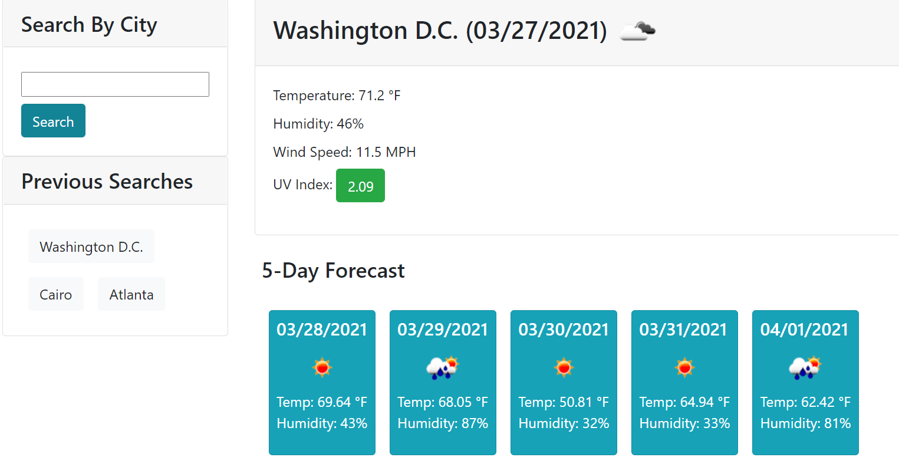

# OpenWeather Dashboard

## Table of Contents
- [Project Overview](#project-overview)
- [Live Application](#live-application)
- [License](#license)
- [Screenshot](#screenshot)

## Project Overview
Weather Dashboard 1.0 buildout. Developer created single-window application to display current weather and 5-day forecast for cities searched by user. Application leverages <a href="https://openweathermap.org/api" target="_blank">OpenWeather API</a> to pull weather and forecast informaton for cities across the world. JavaScript is used to dynamically update HTML with data requested through fetch methods and parsed by JSON, and UI is structured using Bootstrap with minimal CSS customizations for sleek, mobile-first interface. Moment.js is called to display current date and future dates for 5-day forecast.

localStorage is leveraged to save search queries so that user can access previous searches under Previous Searches section during current session and between sessions in browser. User is able to easily search previous cities with buttons that are assigned event listeners to call OpenWeather API with associated city by pulling the button's custom data-city HTML attribute.

### Technologies Used:
- JavaScript
- HTML
- CSS

### External Libraries/APIs Used:
- [OpenWeather API](https://openweathermap.org/api)
- [Moment.js](https://momentjs.com/)
- [Bootstrap](https://getbootstrap.com/)

## Live Application
https://weather.stephentechblog.com

## License
Permission is hereby granted, free of charge, to any person obtaining a copy of this Software and associated documentation files (the "Software"), to deal in the Software without  restriction, including without limitation the rights to use, copy, modify, merge, publish distribute, sublicense, and/or sell copies of the Software, and to permit persons to whom the Software is furnished to do so, subject to the following conditions.

[View the full license](./LICENSE).

## Screenshot

